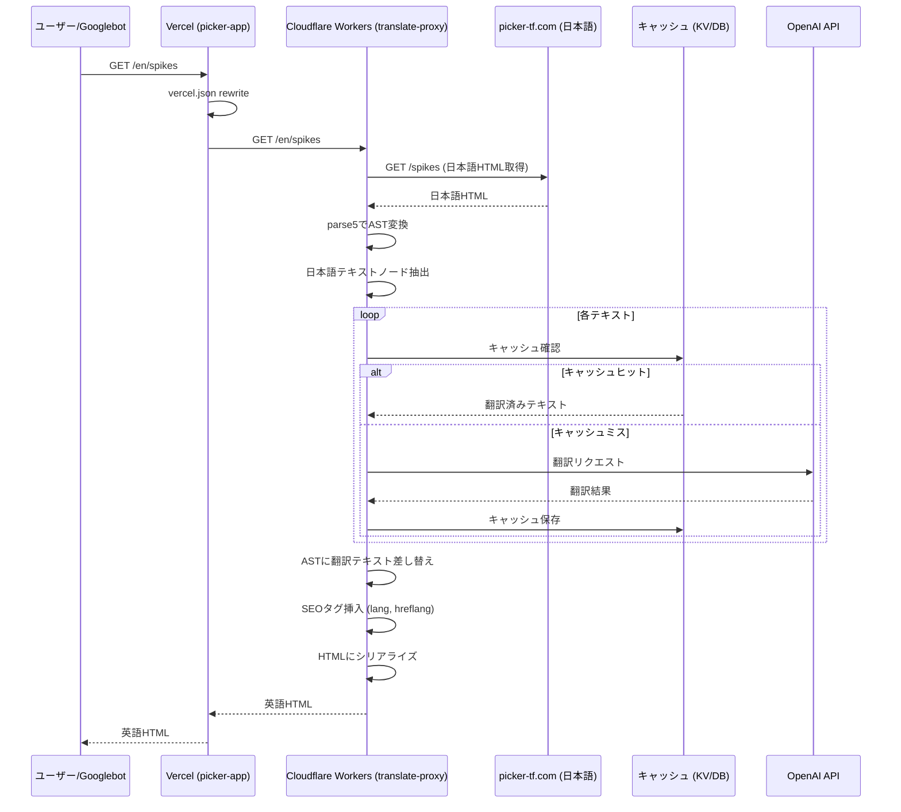
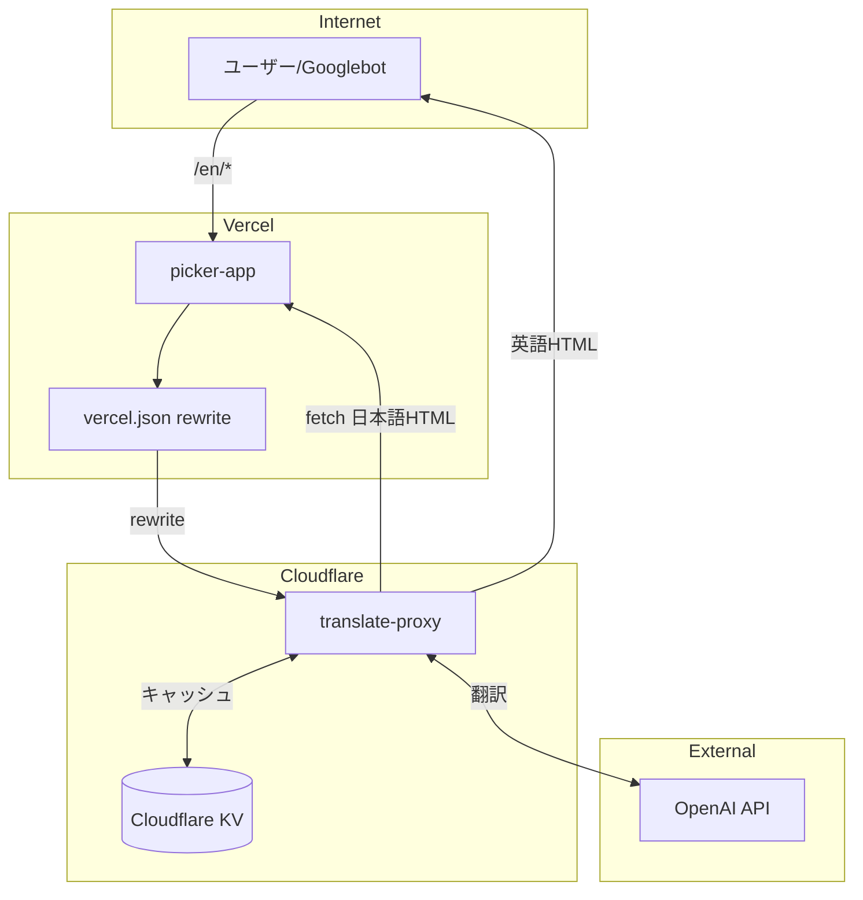
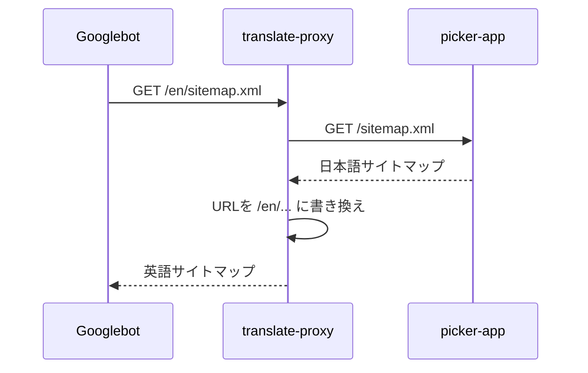
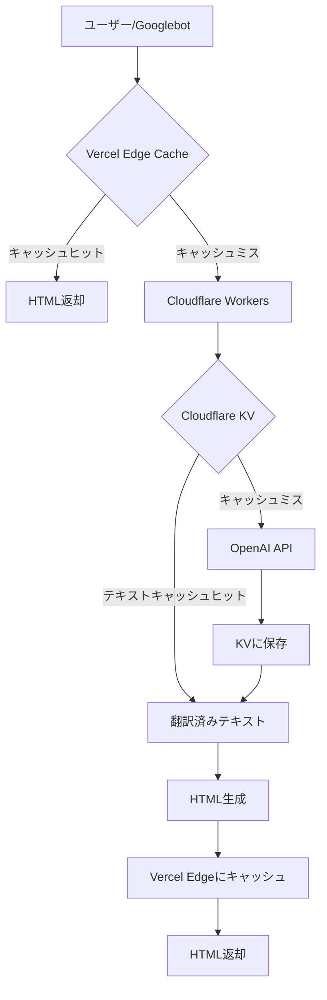
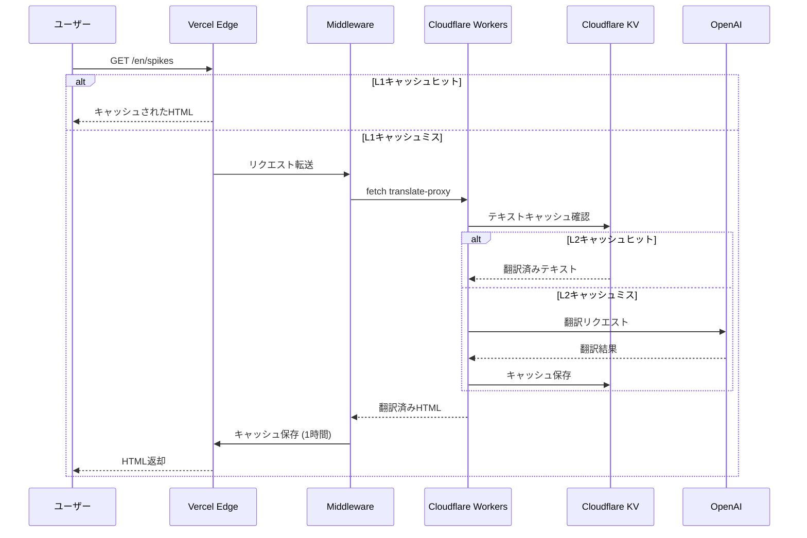

# translate-proxy

picker-app（日本語サイト）を多言語対応するための翻訳プロキシサーバー。
Hono + Cloudflare Workers で構築。

## アーキテクチャ

### 翻訳フロー



### システム構成



### URL構造

| URL | 処理先 | 内容 |
|-----|--------|------|
| `picker-tf.com/spikes` | picker-app | 日本語（オリジナル） |
| `picker-tf.com/en/spikes` | translate-proxy | 英語翻訳 |

## SEO対応

### translate-proxyが担当するSEO処理

1. **lang属性の設定**

```html
<html lang="en">  <!-- 英語版 -->
```

2. **hreflangタグの挿入**

```html
<link rel="alternate" hreflang="ja" href="https://picker-tf.com/spikes" />
<link rel="alternate" hreflang="en" href="https://picker-tf.com/en/spikes" />
<link rel="alternate" hreflang="x-default" href="https://picker-tf.com/spikes" />
```

3. **canonicalタグの設定**

```html
<link rel="canonical" href="https://picker-tf.com/en/spikes" />
```

### サイトマップ

| URL | 内容 |
|-----|------|
| `/sitemap.xml` | 日本語ページ（picker-app既存） |
| `/en/sitemap.xml` | 英語ページ（translate-proxy生成） |



### robots.txt（picker-app側に追記が必要）

```txt
Sitemap: https://picker-tf.com/sitemap.xml
Sitemap: https://picker-tf.com/en/sitemap.xml
```

## キャッシュ戦略

### 2層キャッシュ構成



### キャッシュ層

| 層 | 場所 | キャッシュ対象 | TTL | 用途 |
|----|------|---------------|-----|------|
| L1 | Vercel Edge | ページ全体(HTML) | 1時間 | 高速レスポンス |
| L2 | Cloudflare KV | テキスト単位 | 永続 | 翻訳コスト削減 |

### L1: Vercel Edge Cache（picker-app側で実装）

```typescript
// picker-app/middleware.ts
import { NextResponse } from 'next/server'
import type { NextRequest } from 'next/server'

export async function middleware(request: NextRequest) {
  const { pathname } = request.nextUrl

  if (pathname.match(/^\/en(\/|$)/)) {
    const response = await fetch(
      `https://translate-proxy.xxx.workers.dev${pathname}`,
      { next: { revalidate: 3600 } }
    )

    return new NextResponse(response.body, {
      headers: {
        'Content-Type': 'text/html; charset=utf-8',
        'Cache-Control': 's-maxage=3600, stale-while-revalidate=86400',
      },
    })
  }
}

export const config = {
  matcher: ['/en/:path*'],
}
```

### L2: Cloudflare KV Cache（translate-proxy側で実装）

```typescript
const cacheKey = `${lang}:${sha256(text)}`
const cached = await env.KV.get(cacheKey)

if (cached) return cached

const translated = await translateWithOpenAI(text, lang)
await env.KV.put(cacheKey, translated)
return translated
```

### キャッシュフロー



### メリット

- **高速レスポンス**: L1ヒット時はVercel Edgeから即座に返却
- **コスト削減**: OpenAI APIコールを最小化
- **スケーラビリティ**: Edgeキャッシュで大量アクセスに対応
- **永続性**: 翻訳結果はKVに永続保存

## 導入手順

### 1. translate-proxyをデプロイ（済み）

Cloudflare Workersにデプロイ済み:
- URL: `https://translate-proxy.hbtatsu.workers.dev`

### 2. 呼び出し元サーバー（Vercel等）でrewrite設定

`/en/*` へのリクエストをtranslate-proxyに転送する設定を追加します。

#### 方法A: middleware.ts（推奨）

キャッシュ制御が可能で、ロジックの追加もしやすい方法です。

```typescript
// middleware.ts
import { NextResponse } from 'next/server'
import type { NextRequest } from 'next/server'

export async function middleware(request: NextRequest) {
  const { pathname } = request.nextUrl

  if (pathname.match(/^\/en(\/|$)/)) {
    const response = await fetch(
      `https://translate-proxy.hbtatsu.workers.dev${pathname}`,
      { next: { revalidate: 3600 } } // 1時間キャッシュ
    )

    return new NextResponse(response.body, {
      headers: {
        'Content-Type': 'text/html; charset=utf-8',
        'Cache-Control': 's-maxage=3600, stale-while-revalidate=86400',
      },
    })
  }
}

export const config = {
  matcher: ['/en/:path*'],
}
```

#### 方法B: vercel.json

設定のみでシンプルに実現できます（キャッシュ制御は限定的）。

```json
{
  "rewrites": [
    {
      "source": "/en/:path*",
      "destination": "https://translate-proxy.hbtatsu.workers.dev/en/:path*"
    }
  ]
}
```

#### 比較

| 方法 | メリット | デメリット |
|------|----------|------------|
| middleware.ts | キャッシュ制御可能、ロジック追加しやすい | コード追加が必要 |
| vercel.json | 設定のみ、シンプル | キャッシュ制御は限定的 |

### 3. 動作確認

```bash
# 英語版ページにアクセス
curl https://your-domain.com/en/spikes
```

翻訳されたHTMLが返却されれば成功です。

## デプロイ先

- **URL**: <https://translate-proxy.hbtatsu.workers.dev>
- **Platform**: Cloudflare Workers

## エンドポイント

### ヘルスチェック

```bash
curl https://translate-proxy.hbtatsu.workers.dev/health
```

### 翻訳

```bash
curl https://translate-proxy.hbtatsu.workers.dev/en/spikes
```

## 開発

```bash
# ローカル開発
pnpm dev

# デプロイ
pnpm deploy
```
