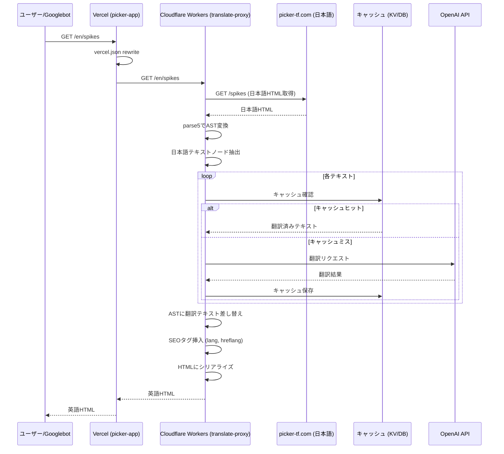
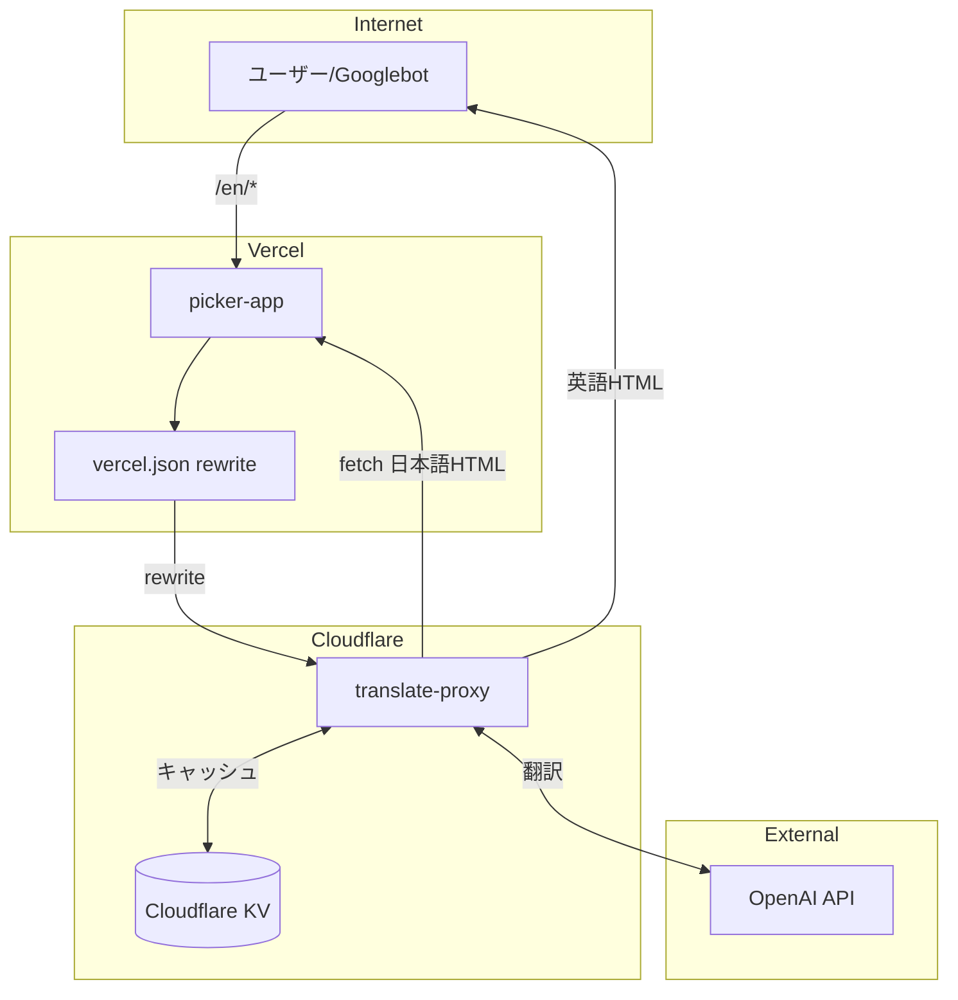
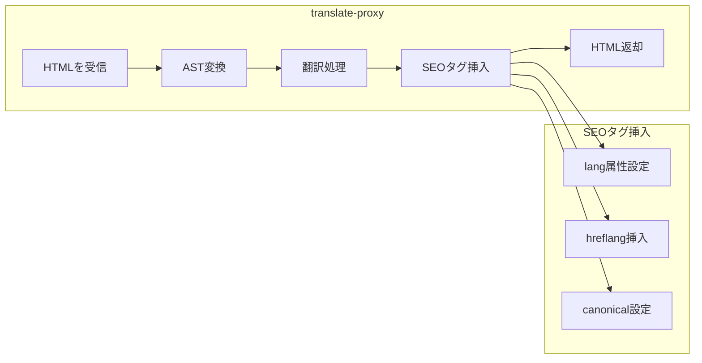
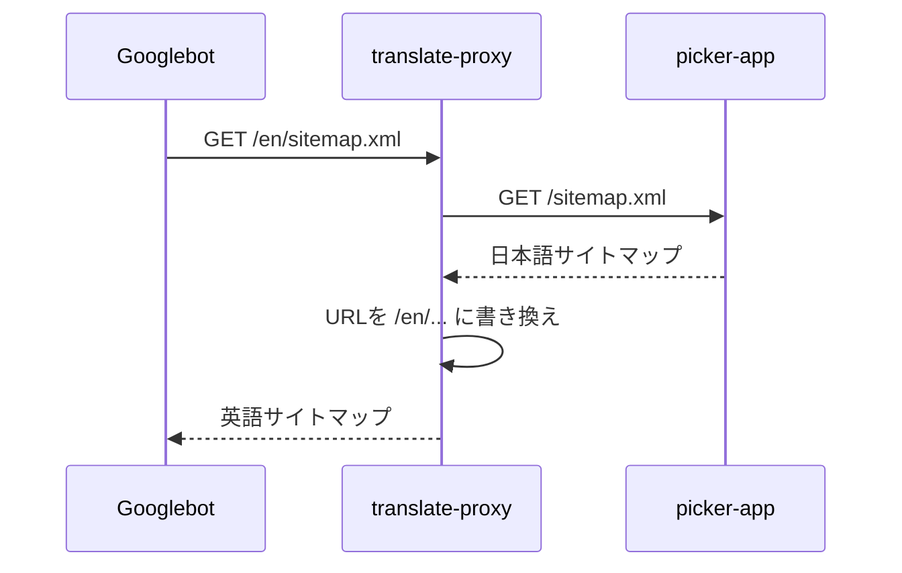
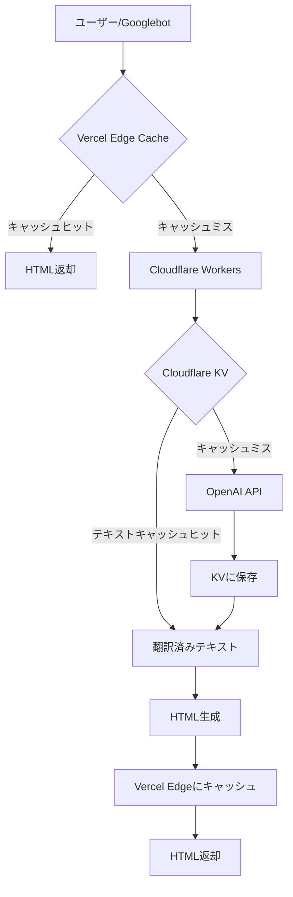
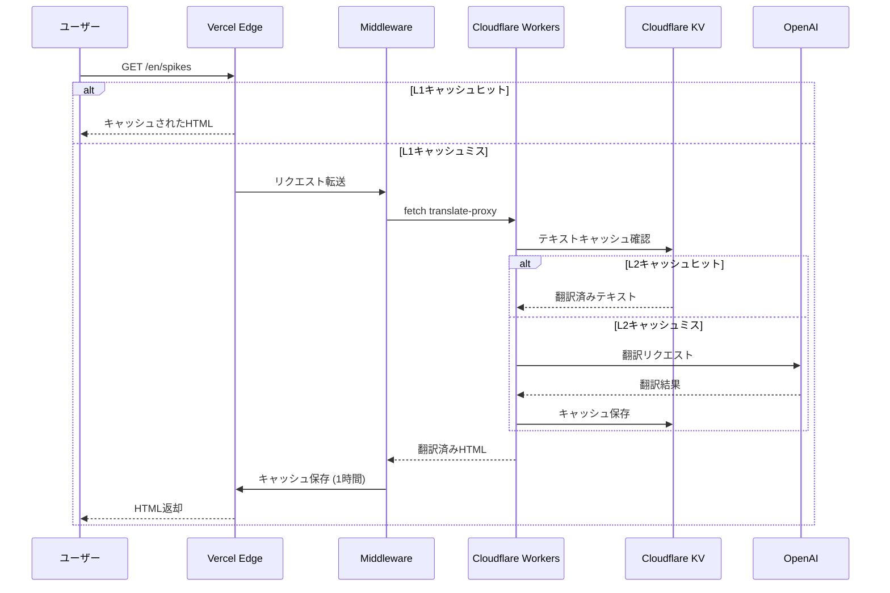

# translate-proxy アーキテクチャ

## 翻訳フロー



## システム構成



## URL構造

| URL | 処理先 | 内容 |
|-----|--------|------|
| `picker-tf.com/spikes` | picker-app | 日本語（オリジナル） |
| `picker-tf.com/en/spikes` | translate-proxy | 英語翻訳 |

---

## SEO対応

### translate-proxyが担当するSEO処理



### 1. lang属性

```html
<!-- 英語版 -->
<html lang="en">
```

### 2. hreflangタグ

各ページの`<head>`に挿入:

```html
<link rel="alternate" hreflang="ja" href="https://picker-tf.com/spikes" />
<link rel="alternate" hreflang="en" href="https://picker-tf.com/en/spikes" />
<link rel="alternate" hreflang="x-default" href="https://picker-tf.com/spikes" />
```

### 3. canonicalタグ

```html
<!-- /en/spikes の場合 -->
<link rel="canonical" href="https://picker-tf.com/en/spikes" />
```

---

## サイトマップ対応

### エンドポイント

| URL | 内容 |
|-----|------|
| `/sitemap.xml` | 日本語ページ（picker-app既存） |
| `/en/sitemap.xml` | 英語ページ（translate-proxy生成） |

### 処理フロー



### サイトマップ変換例

**元の sitemap.xml:**
```xml
<?xml version="1.0" encoding="UTF-8"?>
<urlset xmlns="http://www.sitemaps.org/schemas/sitemap/0.9">
  <url>
    <loc>https://picker-tf.com/</loc>
  </url>
  <url>
    <loc>https://picker-tf.com/spikes</loc>
  </url>
</urlset>
```

**生成される /en/sitemap.xml:**
```xml
<?xml version="1.0" encoding="UTF-8"?>
<urlset xmlns="http://www.sitemaps.org/schemas/sitemap/0.9">
  <url>
    <loc>https://picker-tf.com/en/</loc>
  </url>
  <url>
    <loc>https://picker-tf.com/en/spikes</loc>
  </url>
</urlset>
```

---

## robots.txt

picker-app側の`robots.txt`に追記が必要:

```txt
Sitemap: https://picker-tf.com/sitemap.xml
Sitemap: https://picker-tf.com/en/sitemap.xml
```

---

## キャッシュ戦略

### 2層キャッシュ構成



### キャッシュ層の詳細

| 層 | 場所 | キャッシュ対象 | TTL | 用途 |
|----|------|---------------|-----|------|
| L1 | Vercel Edge | ページ全体(HTML) | 1時間 | 高速レスポンス |
| L2 | Cloudflare KV | テキスト単位 | 永続 | 翻訳コスト削減 |

### L1: Vercel Edge Cache

picker-app側のMiddlewareで実装:

```typescript
// picker-app/middleware.ts
import { NextResponse } from 'next/server'
import type { NextRequest } from 'next/server'

export async function middleware(request: NextRequest) {
  const { pathname } = request.nextUrl

  // /en/* の場合
  if (pathname.match(/^\/en(\/|$)/)) {
    const response = await fetch(
      `https://translate-proxy.xxx.workers.dev${pathname}`,
      { next: { revalidate: 3600 } } // 1時間キャッシュ
    )

    return new NextResponse(response.body, {
      headers: {
        'Content-Type': 'text/html; charset=utf-8',
        'Cache-Control': 's-maxage=3600, stale-while-revalidate=86400',
      },
    })
  }
}

export const config = {
  matcher: ['/en/:path*'],
}
```

### L2: Cloudflare KV Cache

translate-proxy側で実装:

```typescript
// テキスト単位でキャッシュ
const cacheKey = `${lang}:${sha256(text)}`
const cached = await env.KV.get(cacheKey)

if (cached) {
  return cached // キャッシュヒット
}

// キャッシュミス → OpenAI翻訳
const translated = await translateWithOpenAI(text, lang)
await env.KV.put(cacheKey, translated) // 永続保存

return translated
```

### キャッシュキー形式

**L1 (Vercel Edge):**
```
URLパス: /en/spikes
```

**L2 (Cloudflare KV):**
```
{言語コード}:{テキストのSHA256ハッシュ}
例: en:a1b2c3d4e5f6...
```

### キャッシュフロー詳細



### メリット

1. **高速レスポンス**: L1ヒット時はVercel Edgeから即座に返却
2. **コスト削減**: OpenAI APIコールを最小化
3. **スケーラビリティ**: Edgeキャッシュで大量アクセスに対応
4. **永続性**: 翻訳結果はKVに永続保存、再翻訳不要
